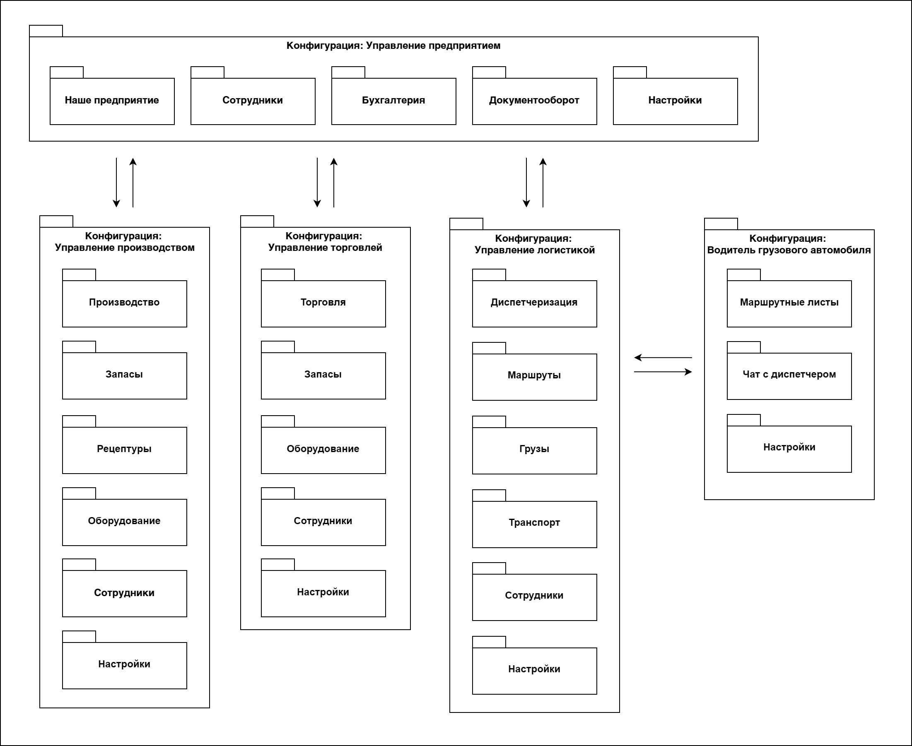

# Управление торговлей

## О конфигурации

Версия программы соответствовует номеру лабораторной работы. Текущая версия «0.0.0.1» из «0.0.0.21». 

## Архитектура

<!--
## Верификация ПО

### Функциональное тестирование

### Поведенческое тестирование

Allure Report

### Интеграционное тестирование

Allure Report

### Нагрузочное тестирование

-->
## Источники 

1. Челябинский государственный педагогический университет, 1С Предприятие 8 2 Практ работы.docx // StudFiles URL: https://studfile.net/preview/2975443/
2. Московский городской педагогический университет, ПИС.-All in one =). 1С.doc // StudFiles URL: https://studfile.net/preview/7175179/
3. Книга "1С Предприятие 8.3 Практическое пособие разработчика. Примеры и типовые приемы" Радченко М.Г., Хрусталева Е.Ю.

