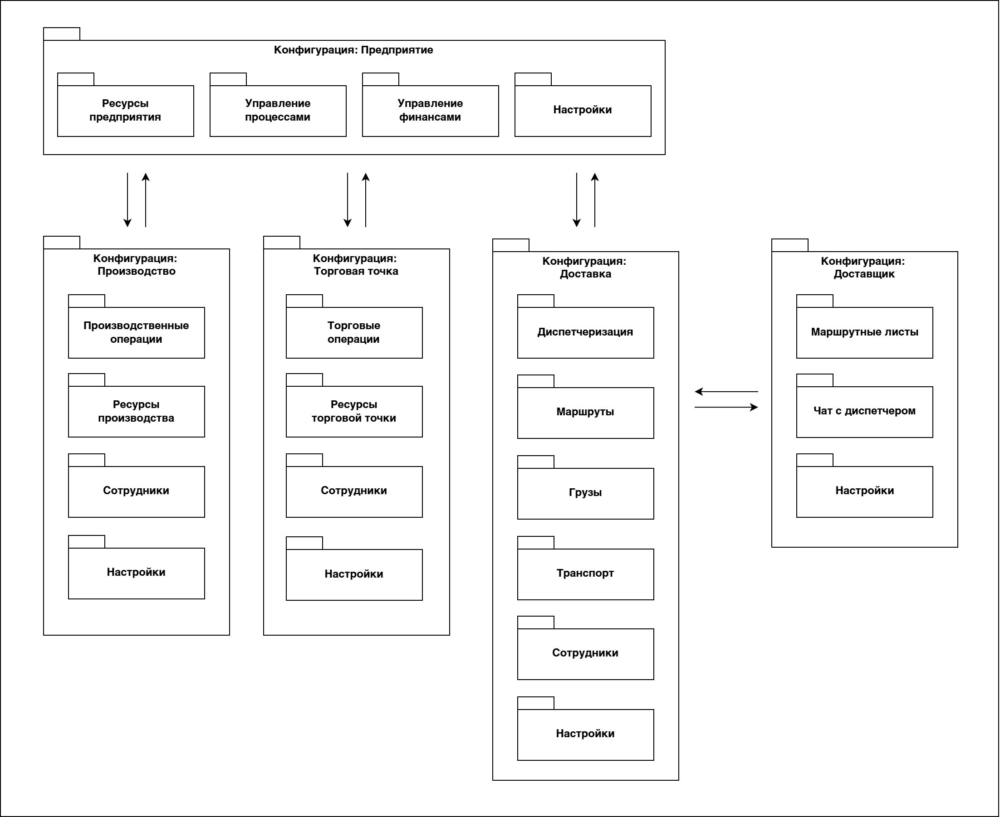

# Конфигурация "Предприятие"

Для автоматизации выбираю Республику Карелия. Это должен быть регион по производству товаров для спорта и отдыха. 

## Архитектура

Архитектура системы:

Архитектура конфигурации:

<!--
## Верификация ПО

### Функциональное тестирование

### Поведенческое тестирование

Allure Report

### Интеграционное тестирование

Allure Report

### Нагрузочное тестирование

-->
## Источники 

1. Тхамадокова Асият Абусуфьяновна › Материалы // Инфоурок URL: https://infourok.ru/user/thamadokova-asiyat-abusufyanovna/material
2. Челябинский государственный педагогический университет, 1С Предприятие 8 2 Практ работы.docx // StudFiles URL: https://studfile.net/preview/2975443/
3. Московский городской педагогический университет, ПИС.-All in one =). 1С.doc // StudFiles URL: https://studfile.net/preview/7175179/
4. Книга "1С Предприятие 8.3 Практическое пособие разработчика. Примеры и типовые приемы" Радченко М.Г., Хрусталева Е.Ю.

